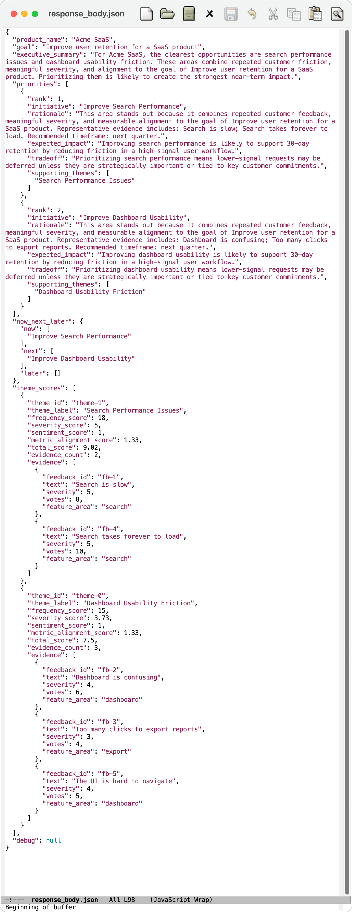

# AI Product Copilot  
### Decision Intelligence for Product Teams

AI Product Copilot is an AI-powered system that transforms **user feedback, product metrics, and business goals** into **prioritized product roadmaps with clear rationale and tradeoffs**.

---

## The Problem

Product teams constantly face:

> What should we build next — and why?

In reality:
- Feedback is noisy and unstructured  
- Metrics are fragmented  
- Prioritization is subjective  
- Tradeoffs are rarely explicit  

---

## The Solution

AI Product Copilot acts as a **decision layer** that:

- clusters feedback into meaningful themes  
- scores themes using product signals  
- aligns decisions to business goals  
- outputs a **prioritized roadmap with reasoning**

---

## Example Output

```json
{
  "executive_summary": "The clearest opportunities are search performance and dashboard usability. These areas show repeated customer friction and strong alignment to retention goals.",
  "priorities": [
    {
      "initiative": "Improve Search Performance",
      "expected_impact": "Improving search performance is likely to support 30-day retention by reducing friction in a high-usage workflow."
    },
    {
      "initiative": "Improve Dashboard Usability",
      "expected_impact": "Improving dashboard usability is likely to improve engagement by simplifying navigation."
    }
  ],
  "now_next_later": {
    "now": ["Improve Search Performance"],
    "next": ["Improve Dashboard Usability"],
    "later": []
  }
}
```



---

## Architecture

```
Input Layer → Processing → Scoring → Decision → Output
```


[User / PM]
     ↓
[FastAPI API Layer]
     ↓
[Ingestion & Normalization]
     ↓
-------------------------------
|   Processing Layer          |
|-----------------------------|
| TF-IDF + KMeans (Themes)   |
| Sentiment + Severity       |
| Frequency Calculation      |
-------------------------------
     ↓
[Alignment Engine]
 (Metrics + Goals Mapping)
     ↓
[Scoring Engine]
 (Weighted Decision Model)
     ↓
[Recommendation Engine]
     ↓
[Roadmap Generator]
 (Now / Next / Later)
     ↓
[API Response + Debug Output]

---

## Core Capabilities

- Feedback theme detection (TF-IDF + KMeans)
- Signal-based scoring (frequency, severity, sentiment, metric alignment)
- AI-assisted prioritization
- Executive summary generation
- Explainable recommendations with evidence

---

## Tech Stack

- FastAPI (API layer) 
- scikit-learn (clustering) 
- Python (scoring + logic) 
- Modular service architecture

---

## Project Structure

```
app/
  api/routes.py
  core_config.py
  main.py
  models/schemas.py
  services/
    embedding.py
    feedback.py
    llm.py
    prioritization.py
    scoring.py
data/
  sample_feedback.json
  sample_metrics.json
run_demo.py
requirements.txt
README.md
```

---

## Quick Start

```bash
python3 -m venv .venv
source .venv/bin/activate
pip install -r requirements.txt
uvicorn app.main:app --reload
```

Open: http://127.0.0.1:8000/docs

#### Input for api/copilot/analyze:
{
  "product_name": "Acme SaaS",
  "goal": {
    "summary": "Improve user retention for a SaaS product",
    "target_metric": "30-day retention",
    "timeframe": "next quarter"
  },
  "feedback": [
    {
      "id": "fb-1",
      "source": "ticket",
      "text": "Search is slow",
      "sentiment": -1,
      "severity": 5,
      "feature_area": "search",
      "customer_segment": "SMB",
      "votes": 8
    },
    {
      "id": "fb-2",
      "source": "review",
      "text": "Dashboard is confusing",
      "sentiment": -1,
      "severity": 4,
      "feature_area": "dashboard",
      "customer_segment": "mid-market",
      "votes": 6
    },
    {
      "id": "fb-3",
      "source": "ticket",
      "text": "Too many clicks to export reports",
      "sentiment": -1,
      "severity": 3,
      "feature_area": "export",
      "customer_segment": "enterprise",
      "votes": 4
    },
    {
      "id": "fb-4",
      "source": "ticket",
      "text": "Search takes forever to load",
      "sentiment": -1,
      "severity": 5,
      "feature_area": "search",
      "customer_segment": "SMB",
      "votes": 10
    },
    {
      "id": "fb-5",
      "source": "review",
      "text": "The UI is hard to navigate",
      "sentiment": -1,
      "severity": 4,
      "feature_area": "dashboard",
      "customer_segment": "mid-market",
      "votes": 5
    }
  ],
  "metrics": [
    {
      "name": "drop_off_rate",
      "value": 0.4,
      "direction": "lower_is_better",
      "importance": 5,
      "related_area": "onboarding",
      "note": "40% of users drop off after onboarding"
    },
    {
      "name": "search_usage",
      "value": 0.8,
      "direction": "higher_is_better",
      "importance": 4,
      "related_area": "search",
      "note": "Search is one of the most used features"
    },
    {
      "name": "dashboard_usage",
      "value": 0.7,
      "direction": "higher_is_better",
      "importance": 4,
      "related_area": "dashboard",
      "note": "Dashboard is used frequently by active users"
    },
    {
      "name": "export_usage",
      "value": 0.5,
      "direction": "higher_is_better",
      "importance": 2,
      "related_area": "export",
      "note": "Export is moderately used"
    }
  ],
  "max_recommendations": 3,
  "include_debug": false
}
---

## How Scoring Works

| Signal | Meaning |
|------|--------|
| Frequency | How often the issue appears |
| Severity | How painful it is |
| Sentiment | How negative feedback is |
| Metric Alignment | Relevance to product goals |

This keeps the system:

explainable
deterministic
extensible
---

## Why This Project Stands Out

- AI applied to real product decision-making  
- Combines qualitative + quantitative signals  
- Explainable prioritization  
- Strong system design and modular architecture  

---

## Future Enhancements

- Replace TF-IDF with semantic embeddings
- Add impact vs effort prioritization
- Add what-if scenario simulation
- Add UI (Streamlit / React)
- Integrate real LLM for narrative refinement  

---

## Positioning

AI Product Copilot shows how AI moves from analysis to decision-making in product environments.
